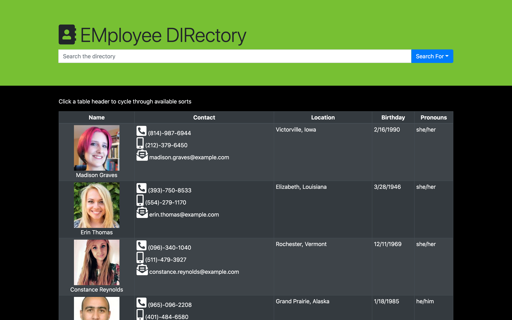

# [EMployee DIRectory](https://thadkingcole.github.io/emdir)


[](LICENSE)
[](code_of_conduct.md)

An employee directory powered by React js



## Table of Contents

- [Installation](#installation)
- [Usage](#usage)
- [Contributing](#contributing)
- [Tests](#tests)
- [Questions](#questions)
- [Credits](#credits)
- [License](#license)

## Installation

No installation is necessary to use the app. However, if you wish to make contributions to this project, follow these steps.

1. Clone this repository using your preferred method.
1. Navigate into the newly cloned repository

    ```terminal
    cd emdir
    ```

1. Install required dependencies

    ```terminal
    npm i
    ```

1. Start up the react development server and begin making your desired changes

    ```terminal
    npm start
    ```

[back to Table of Contents](#table-of-contents)

## Usage

Navigate to <https://thadkingcole.github.io/emdir> to get started.

You can search the directory by name, location, birthday, and/or pronouns by simply typing a search term into the search box at the top of the page, then click the ```Search For``` dropdown button and select the parameter you wish to search.

To clear your search, click the red ```Clear Search``` button.

You can also sort the list by first name, last name, city, state, and birthday. Simply click on the table header for the parameter you wish to search until you reach the desired sort.


[back to Table of Contents](#table-of-contents)

## Contributing

Your contribution is most welcome! Please refer to the contributing guidelines when making contributions to this project.

Please note that this project is released with a [Contributor Code of Conduct](code_of_conduct.md). By Participating in this project, you agree to abide by its terms.

[back to Table of Contents](#table-of-contents)

## Questions

Please direct any and all questions to [thadkingcole](https://github.com/thadkingcole) or via email at [thadjcole@gmail.com](mailto:thadjcole@gmail.com).

[back to Table of Contents](#table-of-contents)

## Credits

I would like to thank the following people/projects/resources:

- [React](https://reactjs.org/)
- [create-react-app](https://create-react-app.dev/)
- [React Bootstrap](https://react-bootstrap.github.io/)
- [Random User Generator](https://randomuser.me/)

[back to Table of Contents](#table-of-contents)

## License

[MIT](LICENSE) copyright (c) 2020 [Thaddeus Cole](mailto:thadjcole@gmail.com).

[back to Table of Contents](#table-of-contents)
